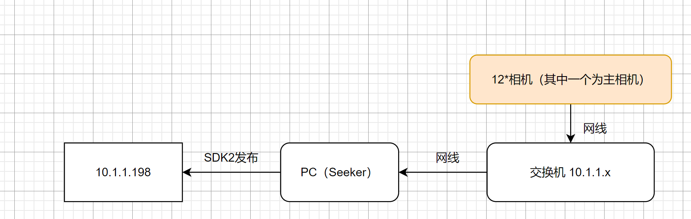

# Nokov-settings-for-SLAM-Groundtruth

### 01 写在前面

这是关于Nokov度量科技动作捕捉设备在获取机器人、无人机等姿态真值的设置说明，动作捕捉设备用于室内SLAM的真值获取可能是目前最佳方式，其精度可达亚毫米级别（不足毫米，但对于SLAM真值来讲已足够）

> **写给大佬：**本方案技术路线：动捕设备获取Markerset的刚体的pose，通过vrpn_server在局域网内广播，在机器人端或者虚拟机端通过vrpn_client在局域网内读取pose数据。
>
> **写给小白：**实验室没这动捕设备是不能通过这个方式获取真值的，请另想其他方法。

本方案仓库中的软件是为方便实验室使用，请有动捕设备的同学关注实现逻辑，不要因为版本问题浪费时间。

### 02 技术路线

### 01 硬件安装及清单

**12个相机**

**12根网线以及12个与相机连接的电源线**

**交换机**

**加密狗**

**L型标定杆 T型标定杆 若干marker** 

### 02 软件安装使用流程

**见Nokov系统操作手册**

### 03 数据处理

#### 001 window下数据输出与画图

使用自带SDK读取数据，具体可见Nokov系统操作手册以及基本操作视频；

#### 002 虚拟机ubuntu下的数据读取

目前可实现虚拟机使用VRPN读取动捕设备的真值；注：虚拟机使用ubuntu16

这个防火墙需要关闭的

对啊，Ubuntu数据就是通过VRPN的协议传到ROS里

NokovVrpnClient.exe XXX@10.1.1.198 ，（XXX 为 Markerset 名称）
