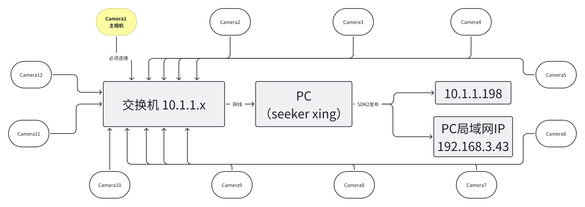
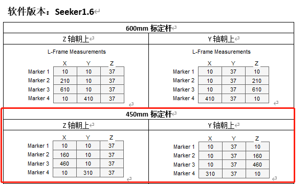
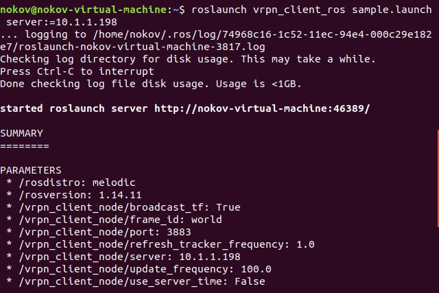
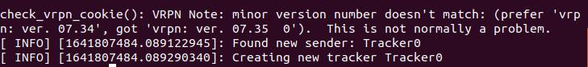
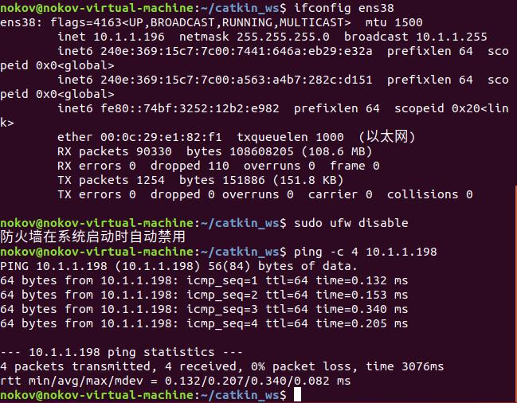
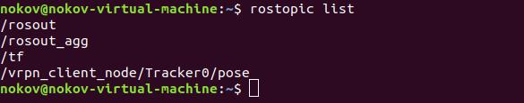
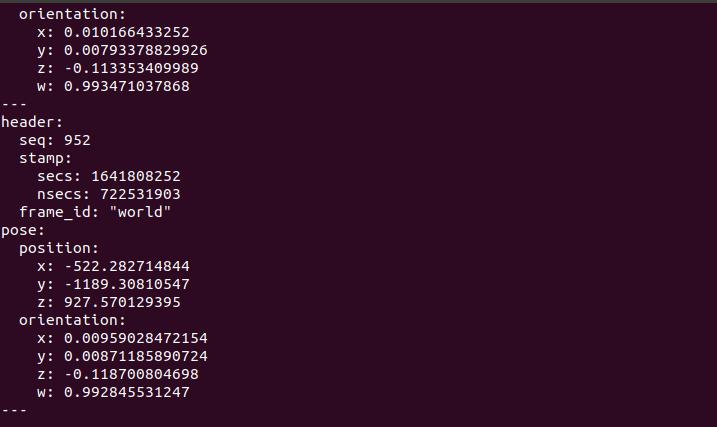

# Nokov-settings-for-SLAM-Groundtruth

### 01 写在前面

这是关于Nokov度量科技动作捕捉设备在获取机器人、无人机等姿态真值的设置说明，动作捕捉设备用于室内SLAM的真值获取可能是目前最佳方式，其精度可达亚毫米级别（不足毫米，但对于SLAM真值来讲已足够）

>  **写给大佬:** 本方案技术路线：动捕设备获取Markerset的刚体的pose，通过vrpn_server在局域网内广播，在机器人端或者虚拟机端通过vrpn_client在局域网内读取pose数据。
>
> **写给小白:** 实验室没这动捕设备是不能通过这个方式获取真值的，请另想其他方法。

本方案仓库中的软件是为方便实验室使用，请有动捕设备的同学关注实现逻辑，不要因为版本问题浪费时间。硬件使用关注docs/XING+1.2.2.X用户手册.pdf

### 02 使用方法
xing软件使用方式简洁版：
在所有标定程序走完后，刚体真值获取步骤：
- 在刚体上贴牢放置至少三个反光小球；
- 打开软件开启相机，使其状态在实时模式下；
- 在屏幕上看到3个小球，Froze
- Ctrl点击三个小球 第二个小球是y轴正方向；
- 右击 Create Rig 并重命名；
- 取消Froze，刚体移动理应在192.168.3.43 IP上可以读到数据；
- 采用vrpn ros读取方式 在同一局域网下192.168.31.3.x的ubuntu中 roslaunch vrpn_client_ros sample.launch server:=192.168.3.43
- 可以终端打印信息看到自己创建的刚体名字
- Rostopic list 看到/vrpn_client_node/zed2/pose  zed2是自己刚体名字
/vrpn_client_node/zed2/pose 话题的数据类型geometry_msgs/PoseStamped

### 03 技术路线

**硬件安装及清单**

**12个相机**

**12根网线以及12个与相机连接的电源线**

**交换机**

**加密狗**

**L型标定杆 T型标定杆 若干marker** 



### 04 数据处理

#### 4.1 window下数据输出与画图

使用自带seeker导出数据，具体可见Nokov系统操作手册以及基本操作视频；

- 打开seeker的SDK发布在某一个局域网内
- 使用NokovVrpnServer发布数据
- 使用NokovVrpnClient读取数据

NokovVrpnClient.exe XXX@10.1.1.198 ，（XXX 为 Markerset 名称）

#### 4.2 虚拟机ubuntu下的数据读取

- 打开seeker的SDK发布在某一个局域网内
- 使用NokovVrpnServer发布数据
- 使用Vrpn_Client_ros读取数据

使用VRPN读取数据，打开seeker软件的SDK发布，通过10.1.1.98（此ip为相机局域网内下电脑网线连接交换机的ip）或者通过无线ip（电脑通过wifi连接的局域网，比如路由器网址为192.168.3.1,电脑wifi的ip为192.168.3.39）

ubuntu端安装ROS

```shell
wget http://fishros.com/install -O fishros && . fishros
```

ubuntu端换清华源

```shell
wget http://fishros.com/install -O fishros && . fishros
```

ubuntu端安装VRPN

```
sudo apt-get install ros-melodic-vrpn
sudo apt-get install ros-melodic-vrpn-client-ros
```

使用以下命令读取数据

```
 //取决于你的NokovVrpnserver中config.ini
roslaunch vrpn_client_ros sample.launch server:=10.1.1.198     
roslaunch vrpn_client_ros sample.launch server:=192.168.3.39   
//连接在同一个局域网下的理论上都可通过vrpn读到，在ubuntu16 18 Jetson nano（ubuntu18）测试成功。
```





从上图可以看出,打印出后面三行,说明是成功连接了。
Connection established
Found new sender:Tracker0
Creating new tracker Tracker0

总结,这个过程最重要的有两个地方,IP 设置一定要对,位于同一网段,能 ping
通,防火墙一定要关,参照如下命令,网卡名称更换为本地网卡。



此时,重新开一个终端,可以查看 topic 话题。
输入下述命令:

```
rostopic list
```

可以看到话题/vrpn_client_node/Tracker0/pose



输入下述命令:

```
rostopic echo /vrpn_client_node/Tracker0/pose
```

可以看到接收到的数据



#### 003 被测物体工控机的数据读取

因为目前工控机大部分也是ubuntu18，从清华源下安装好VRPN后都可读到建立markerset的刚体的pose
